Bài này sẽ tìm hiểu một số nguồn dữ liệu giám sát chính trên windows mà Microsoft đang ngày càng chú trọng phát triển để sử dụng cũng như cung cấp cho các hãng phát triển giải pháp bảo mật khác cùng sử dụng để theo dõi và đảm bảo an toàn cho người dùng khi sử dụng windows.

# Các nguồn dữ liệu để giám sát, phát hiện trên windows

## Event logs

Windows Event Logs là một cơ chế mặc định của hệ điều hành windows ghi lại những sự kiện liên quan đến software, hardware, OS, security, service, application,... Event Logs ghi lại các sự kiện nhằm phát hiện các lỗi hay các vấn đề đang xảy ra với hệ điều hành, các thành phần hệ thống và các phần mềm đang sử dụng. 

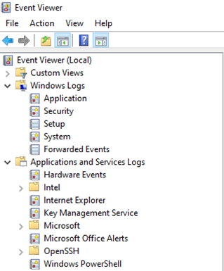

Trên phương diện an toàn thông tin, các sự kiện ghi lại bởi Event Logs có thể giúp phát hiện chuyện gì bất thường đã xảy ra trên hệ thống, thời gian các sự kiện ấy xảy ra hay những tài khoản người dùng nào liên quan đến những hành vi đó. Do đó đây là một nguồn dữ liệu tương đối quan trọng và hay được thu thập bởi các giải pháp giám sát như SIEM để theo dõi và đưa ra cảnh báo khi các sự kiện bất thường xảy ra được ghi lại. Tuy nhiên để sử dụng hiệu quả Windows Event log khi giám sát đảm bảo an toàn thông tin, cần thay đổi một số thiết lập mặc định liên quan tới Process Creation, Powershell, NTLM, WMI,…

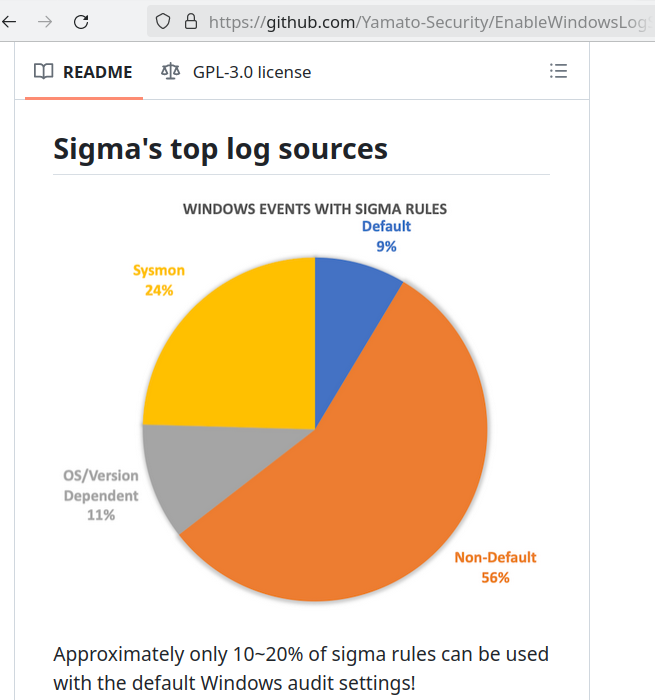

Có thể tìm hiểu nhiều hơn về Event Logs trong các bài viết dưới đây:
- https://sec.vnpt.vn/2022/03/windows-event-logs-1/
- https://sec.vnpt.vn/2023/01/windows-forensicpart2-windows-event-logs/
- https://github.com/Yamato-Security/EnableWindowsLogSettings

## Kernel Callback

Callback/Minifilter là cơ chế thực thi các hàm để xử lý dữ liệu tương ứng khi có các sự kiện đặc biệt xảy ra liên quan đến hệ thống ở tầng Kernel trong windows do sự tương tác của các ứng dụng chạy ở tầng User gây ra.

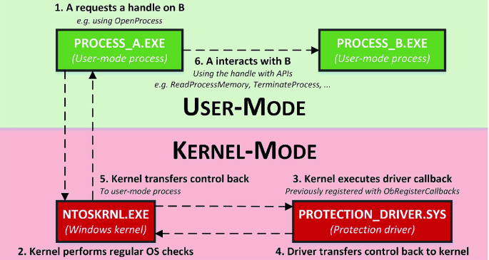

Các callback thường sẽ chạy trong các trình điều khiển của các phần mềm bảo mật như Antivirus/EDR hay Sysmon và được đăng kí với nhân hệ thống để ghi lại nhiều sự kiện khác nhau như liên quan đến tiến trình Process, Registry, File, Network hay nhiều đối tượng khác trong Windows. Việc theo dõi các hành vi này có thể giúp các giải pháp bảo mật xây dựng lên các hình ảnh chi tiết về một tiến trình cụ thể, giám sát xem tiến trình đó thực hiện những hành vi gì trên hệ thống một cách chi tiết, do đó vô cùng hiệu quả trong việc phát hiện các hành vi độc hại. Một số hàm callback phổ biến được sử dụng để theo dõi hành vi các tiền trình được thể hiện như hình dưới đây.

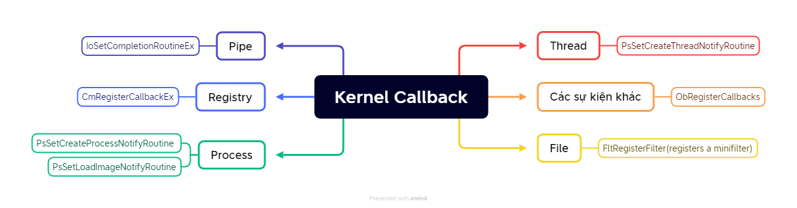

Có thể tham khảo về các sự kiện có thể theo dõi bởi kernel callback trong tài liệu của Sysmon tại đây: https://learn.microsoft.com/en-us/sysinternals/downloads/sysmon#events

## Event Tracing for Windows

Event Tracing for Windows (ETW) là công cụ của windows hỗ trợ các ứng dụng ghi lại log trong quá trình thực thi hoạt động đối với cả thành phần chạy trên tầng user và tầng kernel. Event tracing sẽ hoạt động theo các phiên và bao gồm 3 thành phần chính: Controller, Provider, Consumer.

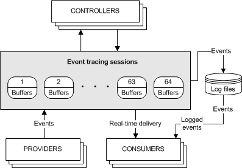

Trong đó:
- Provider: Nguồn dữ liệu sẽ sinh ra log, thường là các ứng dụng, hoặc thành phần dịch vụ hệ thống, nhân hệ điều hành sinh ra.
- Controller: Thành phần kiểm soát provider (bật/tắtcấu hình provider, start/stop các phiên,..)
- Consumer: Nhận log từ provider sinh ra theo thời gian thực hoặc từ các tệp lưu trữ và tiến hành xử lí tùy vào mục đích của chương trình.

Dưới đây là một số các Provider nguồn log hữu ích trong quá trình giám sát an toàn thông tin của hệ thống
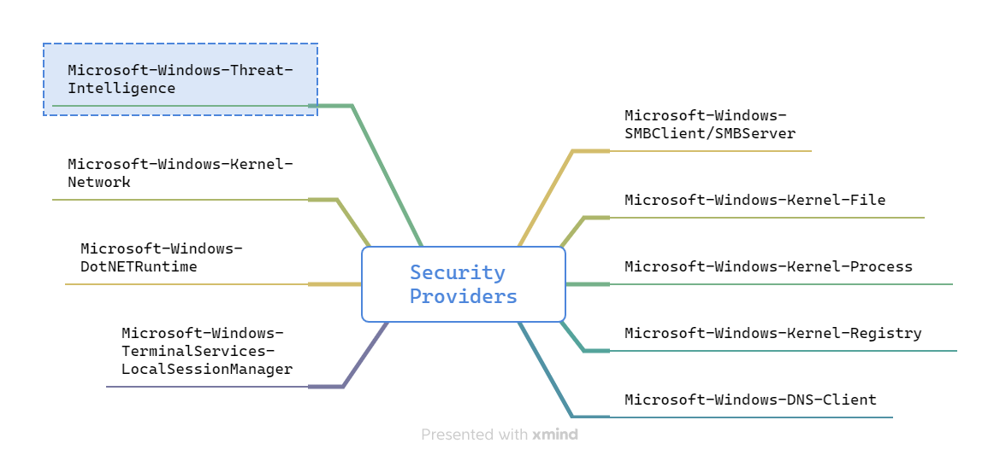

Microsoft đang rất tích cực để xây dựng các provider có sẵn của hệ điều hành để có thể tăng cường giám sát hành vi các ứng dụng trên hệ thống hơn. Đặc biệt là provider Microsoft-Windows-Threat-Intelligence hiện chỉ cho Microsoft và các hãng bảo mật nằm trong danh sách được sử dụng (chạy dưới quyền ProtectedLight).  Provider này cung cấp dữ liệu về quản lí cấp phát vùng nhớ, tạo/sửa các thread local hoặc remote qua đó bổ sung chi tiết cho việc theo dõi các hành vi của tiến trình để tăng cường khả năng phát hiện hành vi độc hại. Có thể tham khảo bài viết này để tìm hiều thêm về cách sử dụng nguồn dữ liệu từ ETW: https://www.ired.team/miscellaneous-reversing-forensics/windows-kernel-internals/etw-event-tracing-for-windows-101

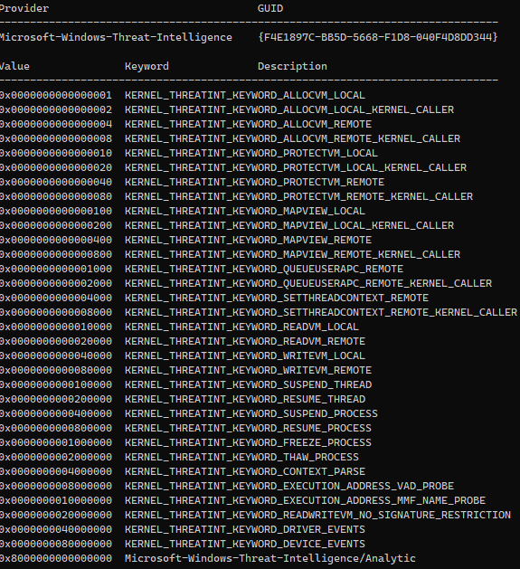

ETW đang dần được sử dụng để thay thế cho phương pháp api hooking đã có trước đó với mục đích theo dõi các api có chức năng tương tự hay bị sử dụng để thực hiện hành vi độc hại như NtAllocateVirtualMemory, NtWriteVirtualMemory, NtQueueApcThread,.... (chi tiết hơn tại: https://github.com/Mr-Un1k0d3r/EDRs)

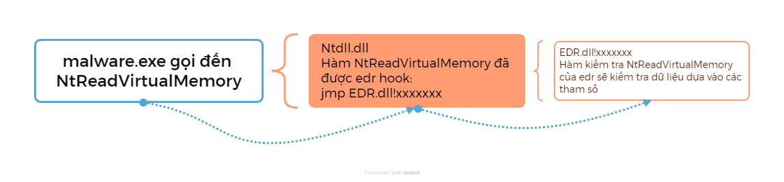

## AMSI (AntiMalwareScanInterface)

Antimalware Scan Interface là chuẩn giao tiếp linh hoạt mà Microsoft phát triển trên windows nhằm cung cấp phương thức giao tiếp giữa các ứng dụng và giải pháp bảo mật đang hoạt động trên windows. Nói cách khác, AMSI có thể được ứng dụng theo 2 cách:
- Cho phép các ứng dụng gửi yêu cầu tới các giải pháp bảo vệ hiện tại để kiểm tra file/vùng nhớ, script, nội dung web, url, ip,.. trước khi thực thi hay xử lí các nội dung đó.
- Cho phép các hãng bảo mật bên thứ 3 tích hợp provider để có thể kiểm tra các nội dung mà các thành phần của windows thực th. Các thành phận đang được tích hợp với AMSI bao gồm:
    - User Account Control
    - Powershell
    - Windows script host
    - JavaScript, VBScript
    - Office VBA macro
    - Excel 4.0 macros 
    - Volume shadow copy operations
    - .NET in-memory assembly loads
    - WMI

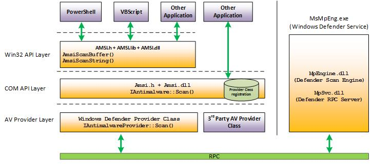

Các giải pháp bảo mật cần cung cấp Provider dưới dạng DLL sẽ được các tiến trình tích hợp với AMSI (powershell, wscript, word,..) load mỗi khi thực thi để có thể kiểm tra các hành vi liên quan thông qua các API như AmsiScanBuffer, AmsiScanString. Cơ chế AMSI này là giải pháp để theo dõi sâu hơn đối với các dòng mã độc fileless thực thi thông qua các script trên windows. Ví dụ đối với các loại mã độc thực thi thông qua VBA macro, kẻ tấn công có thể tiến hành làm rối (obfuscate) đoạn mã thực thi và vượt qua các signature đã có.

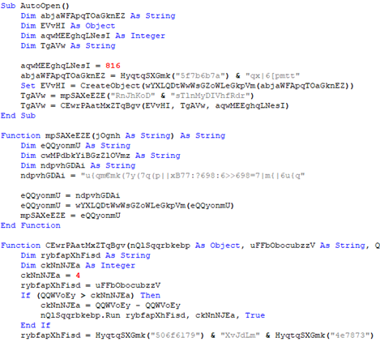

Với AMSI, các hành vi mà đoạn code trên thực thi sẽ được ghi lại và kiểm tra nhiều lớp trước khi chúng được thực thi.

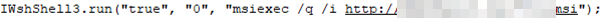

Việc kiểm tra nhiều lớp quá trình thực thi và có thể xem được đoạn mã đọc hại cuối cùng sẽ thực sự gây hại này có thể giúp các giải pháp bảo mật phát triển cách phát hiện và ngăn chặn dễ dàng hơn rất nhiều.

# Vô hiệu các nguồn theo dõi trên

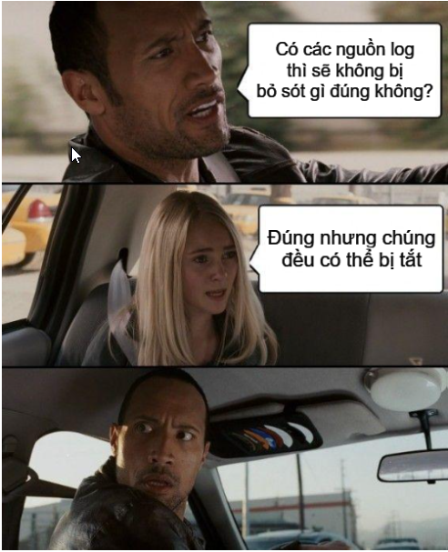

Việc có và sử dụng nhiều nguồn theo rất có ích trong quá trình giám sát an toàn thông tin, điều tra và xử lí sự cố (digital forensics, incident response). Tuy nhiên các nguồn log theo dõi trên cũng đã trở thành mục tiêu mà kẻ tấn công nhắm tới khi muốn loại bỏ các cơ chế theo dõi trên hệ thống. Ví dụ việc hook api được thực hiện ở tầng user, do đó có thể bị vượt qua bởi các kỹ thuật như Api Unhook hay direct system call. Tương tự như vậy, amsi.dll và amsi provider của các giải pháp bảo mật cũng được load vào trong các tiến trình ở usermode do đó đều có thể bị can thiệp vào vô hiệu luồng hoạt động của AMSI, phổ biến nhất vẫn là các kỹ thuật can thiệp vào vùng code của amsi.dll hoặc amsi dll của các provider .

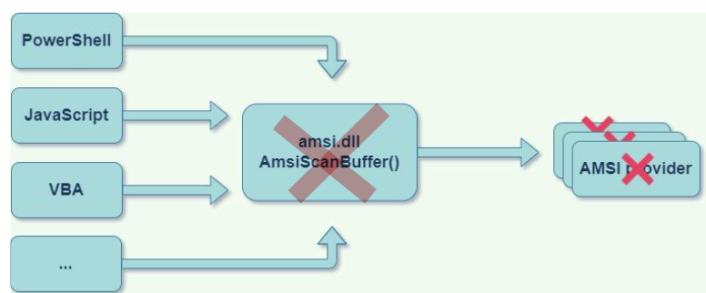

Đối với EventLog, khi kẻ tấn công có quyền Admin/System trên hệ thống sẽ có nhiều công cụ (Invoke-Phant0m, Minikazt) hay phương pháp (Thêm khóa registry MiniNT, sửa kích thước các nguồn log,..) để vô hiệu dịch vụ EventLog của hệ thống.

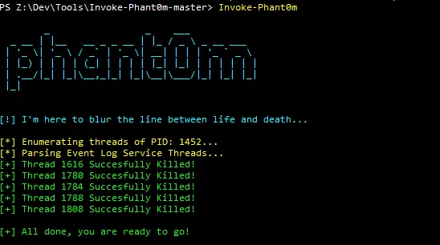

Với ETW và Kernel callback, hoàn toàn có thể tiến hành vô hiệu các Provider cung cấp log hay các callback được đăng ký trước đó. Dưới đây là hình ảnh về POC một chương trình có mục đích như trên ((https://github.com/jthuraisamy/TelemetrySourcerer)

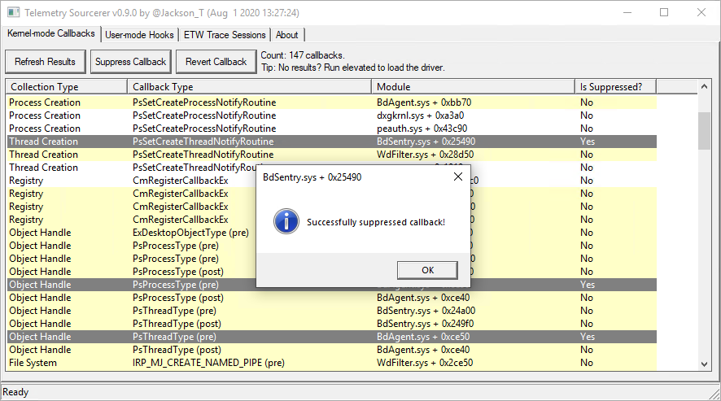

Thực tế cũng đã ghi nhận trong một cuộc tấn công APT của nhóm Lazarus, khi đã có quyền SYSTEM, mã độc đã tiến hành cài và khai thác 1 trình điều khiển chứa lỗ hổng để thực thi hành vi vô hiệu các Callback được đăng kí trên hệ thống nhắm loại bỏ sự theo dõi của các giải pháp bảo mật đã có: https://www.virusbulletin.com/uploads/pdf/conference/vb2022/papers/VB2022-Lazarus-and-BYOVD-evil-to-the-Windows-core.pdf

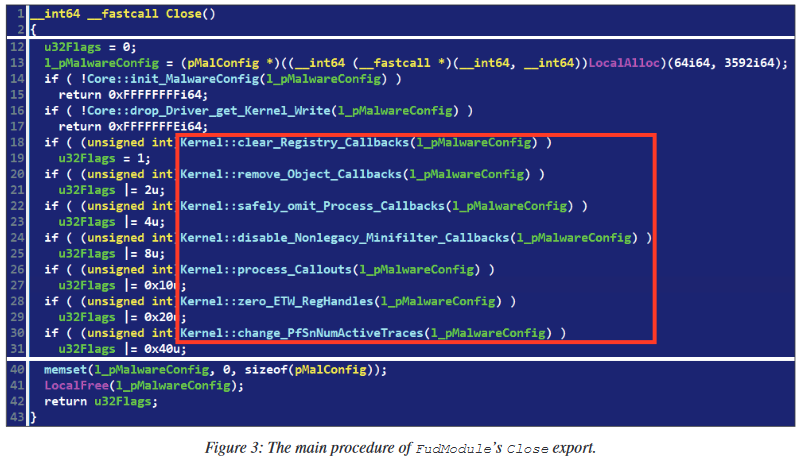

# Phản ứng của Blueteam

Vì sau khi bị vô hiệu thì log hay nguồn dữ liệu để giám sát, phát hiện gần như sẽ không có, nên Blueteam cần phát hiện được các bước trước khi thực thi việc vô hiệu. Đầu tiên là cần phải phát hiện và ngăn chặn được các công cụ đã biết dùng trong việc vô hiệu các nguồn log như một số ví dụ đã kể trên. Việc phát hiện có thể dựa vào các signature, yara rule, hash, imphash, command line... Tiếp đó, để thực hiện vô hiệu EventLog, Kernel Callback hay ETW thì kẻ tấn công cần phải có quyền cao do đó cần chú trọng phát hiện các hành vi leo quyền bất thường trên hệ thống. Có thể kể đến một số phương pháp phổ biến trong việc leo quyền như:
- Sử dụng các tài khoản có quyền cao thu thập được
- Lợi dụng cấu hình các task schedule, service
- Khai thác các lỗ hổng hệ điều hành, phần mềm, uac bypass
- Lợi dụng các quyền đặc biệt như SeImpersonate, SeAssignPrimaryToken,..(*potato, printnightmate…)

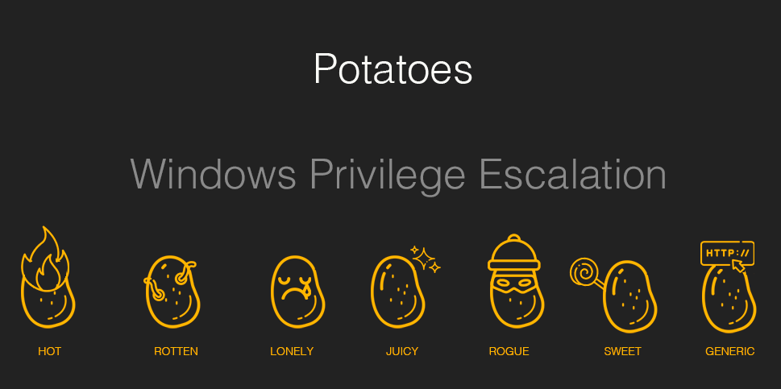

Cần đảm bảo cấu hình các task, service an toàn để hạn chế việc leo quyền cũng như cập nhật các thành phần, ứng dụng hệ thống thường xuyên để giảm khả năng bị khai thác. Khi giám sát cần chú ý tới:
- Các sự kiện tạo mới tiến trình (event id 1, 4688): Tiến trình cha nghi ngờ (w3wp, httpd, msiexec, svchost, services, eventvwr…) tạo các tiến trình khả nghi (whoami, psexec, net, cmd, powershell,…), các tham số đặc biệt của các công cụ “potatos” hay công cụ hay các lệnh thực thi whoami, lệnh thu thập thông tin hệ thống,..
- Các sự kiện audit file, registry (event id 13, 4688, 11, 4664, 4656,..): Các khóa registry, các tập tin nhạy cảm (SAM/SYSTEM, ntds.dit,…)
- Các sự kiện đăng nhập (event id 4625, 4624,…): Kiểm tra dấu hiệu rò quét mật khẩu, các sự kiện đăng nhập từ các host lạ, thời gian đăng nhập bất thường

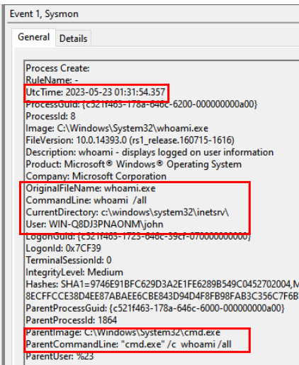

Ngoài ra khi kẻ tấn công leo quyền thành công, cần theo dõi các hành vi khác như  load các driver bất thường, chỉnh sửa các registry cấu hình của Event Log, ETW, thực thi các công cụ vô hiệu nguồn log,.. để phát hiện sớm việc bị vô hiệu các nguồn log và phản ứng kịp thời.

# Kết :()

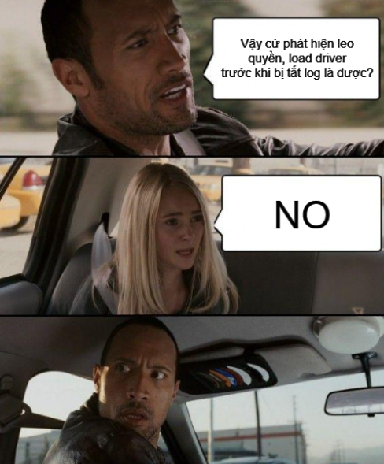

Hiện nay trên Mitre Att&ck liệt kê ra 35 nhóm kỹ thuật bypass, trong đó gồm 148 kỹ thuật nhỏ khác nhau. Bên cạnh đó, việc tích hợp các biện pháp tăng số lượng và chất lượng nguồn dữ liệu giám sát trong môi trường product đã được xây dựng từ lâu còn tương đối hạn chế vì nhiều lí do khác nhau như tính ổn định, khả năng cập nhật chỉnh sửa các thành phần hệ thống, ứng dụng, tài nguyên hệ thống,... nên một số hệ thống chỉ sử dụng được một số nguồn log hạn chế có sẵn. Do đó cần đa dạng hóa các cách phát hiện đối với các kỹ thuật đã biết dựa trên nhiều nguồn log khác nhau để đề phòng trường hợp một số cách phát hiện có thể bị bypass trên một số nguồn log hoặc một số hệ thống bị thiếu các nguồn log bổ trợ như sysmon, edr, etw,.... 

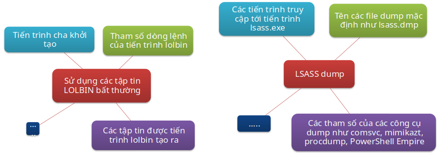

Ngoài ra, nếu kẻ tấn công chú trọng việc tránh bị phát hiện thì một số kỹ thuật sẽ bypass được các phương pháp phát hiện đã biết là khó tránh khỏi. Tuy nhiên, đối với cả một cuộc tấn công, để có thể bypass hoàn toàn từ bước đầu tiên khi tiếp cận hệ thống đến khi đạt được các mục đích mà không để lại dấu vết gì trong cả quá trình đó là rất khó. Vì thể cần cố gắng thực hiện theo dõi giám sát qua nhiều lớp bảo vệ, bổ sung các phương pháp phát hiện nhằm tăng độ bao phủ các ttps trong Mitre Att&ck để có thể kịp thời và ngăn chặn các cuộc tấn công trước khi kẻ tấn công đạt được mục tiêu.

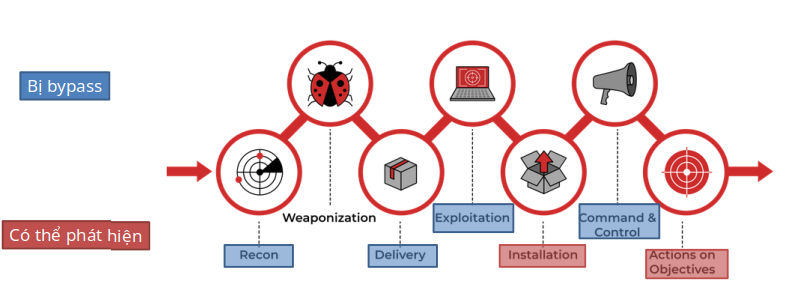

# Tài liệu tham khảo khác
- https://github.com/jsecurity101/TelemetrySource
- https://github.com/tsale/EDR-Telemetry
- https://i.blackhat.com/Asia-22/Friday-Materials/AS-22-Korkos-AMSI-and-Bypass.pdf