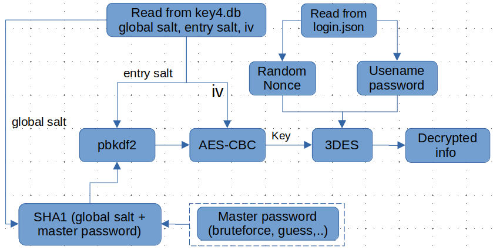

---
layout: post
title:  Mã độc lấy dữ liệu từ các trình duyệt trên windows như thế nào 
date: 2024-04-23
subtitle: How malware steal user's browser data on windows
tags:
- windows
- malware
--- 
# Trình duyệt lưu trữ các thông tin tài khoản như thế nào

Trình duyệt chứa nhiều thông tin đăng nhập của người dùng (cookies, username, password, autofill) do đó đang trở thành mục tiêu thường xuyên bị các dòng mã độc đánh cắp dữ liệu (stealer) nhắm tới cùng với các dữ liệu cá nhân khác của người dùng (tài liệu, ví điện tử, tài khoản discord, telegram,...). Bài này sẽ tìm hiểu về cơ chế lưu trữ các thông tin người dùng trên một số trình duyệt phổ biến trên nền tảng windows cũng như cách các loại mã độc stealer đánh các cắp dữ liệu này và các phương án để phòng chống.

Thông thường, các dữ liệu trình duyệt của từng tài khoản người dùng đều được mã hóa bằng 1 cách nào đó khi lưu trên ổ cứng của người dùng.

## Chrome (bao gồm cả các browser dùng nhân chromium như edge, coccoc,..)

Đối với các trình duyệt nhân chromium trên windows, dữ liệu người dùng sẽ được lữu trữ trong các sql database và json data. Mỗi trình duyệt sẽ có 1 thư mục để lưu trữ dữ liệu này, ví dụ mặc định google chrome sẽ sử dụng các thư mục dưới đây để lưu trữ:

- %localappdata%\Google\Chrome\User Data\Default\Cookies: Cookies các trang web đã truy cập
- %localappdata%\Google\Chrome\User Data\Default\Login Data: - Username & password các tài khoản
- %localappdata%\Google\Chrome\User Data\Local State: chứa key giải mã tại trường “os_crypt”.

Các dữ liệu này được bảo vệ bằng cách được mã hóa với một key được sinh ngẫu nhiên và key đó được bảo vệ qua các bước sau:

- Tạo key AES ngẫu nhiên 
- Sử dụng DPAPI để mã hóa key ở trên. DPAPI là phương pháp mã hóa dữ liệu được windows cung cấp qua api CryptProtectData / CryptUnprotectData để các ứng dụng có thể mã hóa/giải mã dữ liệu người dùng muốn bảo vệ trên hệ điều hành với mật khẩu của người dùng. Có thể tìm hiểu thêm về cách hoạt động của DPAPI ở bài này: [data_protection_api](https://threathunterplaybook.com/library/windows/data_protection_api.html)

- Lưu trữ key sau khi mã hóa tại trường os_crypt trong file %localappdata%\Google\Chrome\User Data\Local State

Mỗi khi cần mã hóa dữ liệu người dùng, Chromium sẽ sinh ra iv ngẫu nhiên và giải mã key trong trường os_crypt bằng DPAPI, sau đó sử dụng thuật toán AES – MODE_GCM để thực hiện mã hóa các dữ liệu như thông tin đăng nhập, cookies trong các file Cookies, LoginData với key vừa giải mã và iv vừa tạo ra. IV và bản mã của thông tin sẽ được lưu trong file database tương ứng như đã đề cập ở phần trên.

Do sử dụng dpapi với key tương ứng với tài khoản người dùng, các mã độc stealer thực thi bằng chính tài khoản người dùng có thể thực hiện việc giải mã key và thông tin tương tự như cách chrome đã mã hóa qua các bước sau:
1. Tìm và đọc key trong file lưu trữ của trình duyệt với mỗi profile (ví dụ với chrome sẽ là %localappdata%\Google\Chrome\User Data\Local State), key thường lưu trong trường os_crypt.
2. Sử dụng DPAPI để giải mã key 
3. Đọc dữ liệu gồm iv và thông tin lưu trữ ở bản mã trong tập tin %localappdata%\Google\Chrome\User Data\Default\Login Data và thực hiện giải mã với thuật toán AES – MODE_GCM đối các dữ liệu bị mã hóa với key đã thu được ở bước 2 và iv kèm theo.

## Firefox

Khác với các trình duyệt Chromium phụ thuộc vào các phương pháp mã hóa hỗ trợ sẵn trên hệ điều hành sử dụng chính tài khoản người dùng để bảo vệ key mã hóa, Firefox sử dụng thư viện riêng Network Security Services (NSS) (nss3.dll) kèm theo master password (nếu người dùng thiết lập) và cách thức khác để mã hóa dữ liệu người dùng trước khi lưu trữ các dữ liệu này trong file json và sqlite tại các file:

- %appdata%\Mozilla\Firefox\Profiles\[profile_name]\key4.db: thông tin về key để giải mã các thông tin người dùng cần bảo vệ
- %appdata%\Mozilla\Firefox\Profiles\[profile_name]\cookies.sqlite: Lưu trữ cookies các trang web (không được mã hóa nếu không có master password)
- %appdata%\Mozilla\Firefox\Profiles\[profile_name]\login.json: Username & password đã được mã hóa

Với mỗi profile, Firefox sẽ sinh ra một số dữ liệu ngẫu nhiên gồm
- key_db: key dùng để mã hóa các dữ liệu người dùng như thông tin đăng nhập, cookies,..
- global_salt: salt dùng trong quá trình mã hóa key_db
- iv để mã hóa key_db
- entry_salt: salt ngẫu nhiên để mã hóa key_db

Sau đó, Firefox sử dụng SHA1 để hash global_salt và master password nếu thiết lập tạo thành secured_hash_data và sử dụng tiếp thuật toán pbkdf2 để sinh ra mật khẩu dùng để mã hóa key_db với các dữ liệu đầu vào phụ thuộc vào secured_hash_data và entry_salt. Mật khẩu này sẽ được sử dụng để mã hóa key_db với thuật toán AES-CBC kèm theo iv ở trên và lưu trong file key4.db.

Mỗi khi cần mã hóa dữ liệu người dùng, Firefox sẽ yêu cầu nhập master password nếu người dùng thiết lập và sử dụng các thông tin được lưu trữ trong file key4.db gồm global_salt, iv, entry_salt để giải mã key_db. Sau đó key_db và iv sinh ngâu nhiên sẽ được dùng để mã hóa các thông tin cần được bảo vệ như username, mật khẩu bằng thuật toán 3DES.

Giả sử người dùng không thực hiện thiết lập master password, các chương trình mã độc có thể dựa vào các thông tin lưu trữ trong key4.db để tiến hành giải mã key_db:
1. Đọc các dữ liệu global_salt, iv, entry_salt trong file key4.db và sử dụng chúng để giải mã ra key_db.

2. Đọc các thông tin tài khoản trong login.json, giải mã với key_db thu được ở bước 1.

3. Nếu người dùng thiết lập master password, có thể thử bruteforce master password cho đến khi decrypt được key_db và giải mã được các dữ liệu thông tin người dùng

## 
Có thể thấy đối với thông tin lưu trữ của các trình duyệt chromium, bất kì chương trình nào, kể cả mã độc cũng có thể sử dụng DPAPI để giải mã key trong file "Local State" rồi sử dụng key đó để giải mã và đọc được các thông tin tài khoản mật khẩu của người dùng trong file "Login Data". Tương tự, khi sử dụng firefox và người dùng không sử dụng master password hoặc sử dụng master password kém an toàn, dễ bị bruteforce thì các chương trình mã độc cũng hoàn toàn có thể giải mã key_db trong "key4.db" và đánh cắp các dữ liệu được lưu trong "login.json". Do đó việc lưu mật khẩu trên các trình duyệt chromium hay firefox theo cách thông thường đều có nhiều nguy cơ mất an toàn khi mã độc thực thi được trên hệ thống.

Note: Một số trình duyệt chromium-based như Yandex đã phát triển thêm tính năng master password để đảm bảo ngay cả khi thực thi được bằng tài khoản người dùng các ứng dụng cũng không thể giải mã các thông tin tài khoản mà không có master password. Chi tiết xem tại: [browser-passwords-crypto](https://yandex.com/support2/browser-passwords-crypto/en/with-master)

# Làm thế nào để hạn chế bị đánh cắp dữ liệu
Người dùng luôn phải cài đặt, cập nhật các giải pháp bảo mật, phần mềm, hệ điều hành và cẩn trọng với các nội dung từ internet, kiểm tra file tải về trước khi chạy, không sử dụng crack để giảm thiểu các nguy cơ bị phishing và thực thi mã độc. Trong việc quản lí mật khẩu, với việc luôn được khuyến cáo tạo các mật khẩu khó và không lặp lại cho các trang web thì việc tự ghi nhớ và không lưu trữ mật khẩu trên các trình duyệt để tránh bị đánh cắp là không khả thi. Do đó, người dùng có thể
- Dùng các phần mềm quản lý mật khẩu an toàn hơn như bitwarden, keypassxc,..
- Chỉ lưu mật khẩu trong các trình duyệt có cơ chế bảo vệ thông tin an toàn hơn (tránh phụ thuộc vào tài khoản hệ điều hành) như yandex hay firefox và thiết lập master password an toàn để tránh việc bị bruteforce.

Có thể sử dụng các công cụ có chức năng theo dõi và ngăn chặn các tiến trình khi chúng thực hiện đọc dữ liệu từ các file nhạy cảm của trình duyệt như Local State, Login Data, key4.db, login.json. 
Đây là POC công cụ sử dụng nguồn dữ liệu từ Audit Filesystem để theo dõi truy cập tới các file nhạy cảm như trên nhằm phát hiện và ngăn chặn các tiến trình khả nghi đọc tài khoản mật khẩu lưu trữ trong các trình duyệt: [powershell_stealer_detection](https://github.com/hongson11698/powershell_stealer_detection)

Hiện tại công cụ này có thể phát hiện các hành vi nghi ngờ và ngăn chặn nhưng còn một số giới hạn như xảy ra phát hiện nhầm (người dùng truy cập vào, chương trình bên thứ 3 truy cập vào,..) làm ảnh hưởng đến trải nghiệm người dùng nên cần kiểm tra kỹ hơn các tiến trình khi chúng truy cập tới các file kể trên. Ngoài ra, việc sử dụng dữ liệu event audit nên khi phát hiện xử lí thì các ứng dụng độc hại có thể đã đọc 1 phần dữ liệu rồi (cần minifilter nếu muốn kiểm tra và ngăn chặn trước khi các ứng dụng đọc được dữ liệu). Và kẻ tấn công có thể sử dụng một số kỹ thuật như process injection, dll sideload,.. để bypass được việc theo dõi của công cụ.

# Tài liệu tham khảo
- [https://github.com/AlessandroZ/LaZagne](https://github.com/AlessandroZ/LaZagne)
