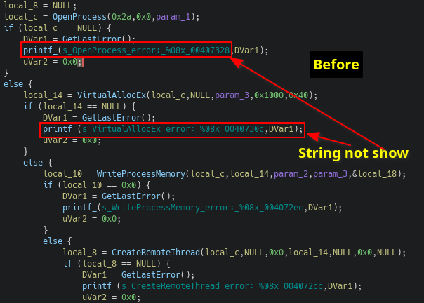
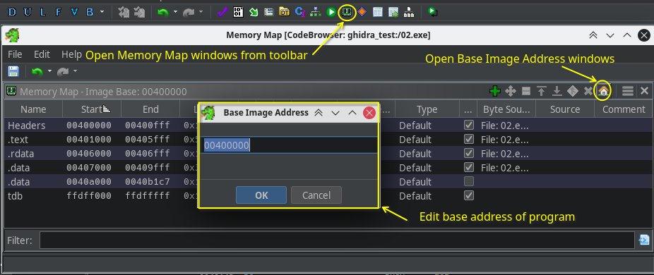

---
layout: post
title: Reverse Engineer với Ghidra
date: 2024-05-31
subtitle: How to Use Ghidra to Reverse Engineer
tags:
- reversing
- general
--- 
- [Giới thiệu về Ghidra](#giới-thiệu-về-ghidra)
  - [Giao diện và chức năng chính](#giao-diện-và-chức-năng-chính)
  - [Code Browser Tool](#code-browser-tool)
- [Sử dụng một số chức năng trên Ghidra khi phân tích, dịch ngược](#sử-dụng-một-số-chức-năng-trên-ghidra-khi-phân-tích-dịch-ngược)
  - [Sử dụng String](#sử-dụng-string)
  - [Đổi tên biến, kiểu dữ liệu của biến, dữ liệu](#đổi-tên-biến-kiểu-dữ-liệu-của-biến-dữ-liệu)
  - [Convert các hằng số sang dạng tên hằng, cách hiển thị khác](#convert-các-hằng-số-sang-dạng-tên-hằng-cách-hiển-thị-khác)
  - [Đổi tên hàm, prototype của hàm](#đổi-tên-hàm-prototype-của-hàm)
  - [Tìm kiếm reference tới các hàm, biến,...](#tìm-kiếm-reference-tới-các-hàm-biến)
  - [Đặt comment](#đặt-comment)
  - [Di chuyển vị trí con trỏ trong Ghidra](#di-chuyển-vị-trí-con-trỏ-trong-ghidra)
  - [Function graph](#function-graph)
  - [Function id](#function-id)
  - [Scripting](#scripting)
  - [Một vài tính năng khác](#một-vài-tính-năng-khác)
    - [Function Call Trees](#function-call-trees)
    - [Thay đổi imagebase của chương trình qua cửa sổ Windows-\>Memory Map.](#thay-đổi-imagebase-của-chương-trình-qua-cửa-sổ-windows-memory-map)
- [Tổng kết](#tổng-kết)
- [Tài liệu tham khảo khác](#tài-liệu-tham-khảo-khác)

# Giới thiệu về Ghidra

[Ghidra](https://github.com/NationalSecurityAgency/ghidra) là một công cụ mã nguồn mở phát triển bởi NSA phục vụ cho mục đích phân tích, dịch ngược các phần mềm, ứng dụng, firmware trên nhiều nền tảng khác nhau. NSA công bố bản Ghidra 9 vào khoảng tháng 4-2019, phiên bản mới nhất hiện tại là 11 đã được bổ sung nhiều tính năng mới hơn. Một số tính năng chính hiện tại:
- Hỗ trợ định dạng binary trên nhiều hệ máy như x86 (16, 32 và 64 bit), arm, aarch64, powerpc, mips,...
- Tích hợp disassembler
- Decompiler hỗ trợ chạy độc lập
- Hỗ trợ debug local/remote trên windows qua windbg hoặc gdb trên linux
- Hỗ trợ tự động trong quá trình phân tích bằng script 
- Có thể mở rộng thông qua exention, plugin
- Hỗ trợ làm việc theo nhóm với GhidraServer
- Free và Opensouce
- Có giao diện và tài liệu hướng dẫn chi tiết kèm theo trực quan (Truy cập menu Help->Content để mở tài liệu)


Ghidra dần trở thành một công cụ dịch ngược tiềm năng dễ tiếp cận và phổ thông hơn với mọi người. Bài này sẽ giới thiệu về Ghidra và ghi lại một số tính năng thường xuyên sử dụng trong quá trình dịch ngược, phân tích.

## Giao diện và chức năng chính

Ghidra tổ chức việc lưu trữ dựa theo project, dạng cây thư mục. Trong đa số trường hợp, việc phân tích sẽ bắt đầu bằng cách mở Ghidra lên và làm theo các bước được hướng dẫn để tạo hoặc mở project từ menu File->Open Project/New Project. Khi tạo mới, project sẽ có thư mục chính trùng với tên được đặt, có thể tạo các thư mục con và sắp xếp các file để dễ quản lí nếu project chứa nhiều file cần phân tích.


Tiếp theo, cần import các file vào project thông qua việc kéo thả các file vào giao diện hoặc từ menu File->Import File. Khi import file vào project, trong đa số trường hợp Ghidra sẽ nhận dạng được file và đưa ra các option về định dạng, ngôn ngữ để có thể phân tích hiệu quả hơn. Đôi khi việc tự động nhận dạng không hỗ trợ (ví dụ với các đoạn shellcode), Ghidra sẽ cho phép người dùng tự chỉ định để có thể đưa ra kết quả phân tích tốt hơn.


Ghidra sẽ cho phép người dùng sử dụng các công cụ (Tool) để có thể phân tích, công cụ mặc định được đặt là Code Browser sẽ được kích hoạt khi double click vào 1 file trong project. Có thể sử dụng chức năng kéo thả các file trong project vào icon các công cụ ở menu tool chest. Có thể tìm hiểu thêm các thao tác khác khi click chuột phải vào từng file. 


## Code Browser Tool

Code Browser là công cụ tương tác nhiều nhất khi phân tích bằng ghidra. Khi mở 1 file lên bằng Code Browser, thường sẽ chọn yes để tiến hành phân tích file này để mở cửa sổ Analysis Option và tiến hành bật/tắt/thay đổi cấu hình các công cụ phân tích (mặc định hoặc được cài vào bởi các plugin, extension).


Thời gian phân tích tùy vào độ phức tạp của từng file, sau khi phân tích xong, Ghidra sẽ mở giao diện chính của code browser bao gồm menu, thanh toolbar, các cửa sổ con (mỗi cửa sổ sẽ cung cấp các thông tin khác nhau trong khi phân tích) và status bar. Có thể thêm các cửa sổ con khác qua menu Windows và tùy chỉnh các cửa sổ con bằng cách resize các viền, kéo thả title cửa sổ để sắp xếp lại vị trí hoặc tạo ra cửa sổ con với nhiều tab. Khi người dùng tự sắp xếp lại, vị trí các cửa sổ sẽ được lưu lại và hiển thị vào lần chạy sau.

Một số cửa sổ sau mặc định sẽ hiện ra:
- Program Tree: Hiển thị cấu trúc của chương trình, tùy vào định dạng file sẽ hiển thị khác nhau.
- Symbol Tree: Hiển thị tên được gán cho các các địa chỉ trong chương trình, các địa chỉ có thể ứng với tên hàm import, export, các hàm được nhận dạng, nhãn của địa chỉ (label),...
- Data type manager: Hiển thị các kiểu dữ liệu trong chương trình.
- Listing: Cửa sổ hiển thị mã disassembly
- Decompile: Hiển thị mã decompile
- Console - Scirpting: Hiển thị thông tin console, output của các script


Một số tips để tùy biến giao diện của Code browser

- Chuyển sang Flat Dark Theme, mặc dù không thích tối thui lắm nhưng dark theme có syntax highlight dễ chịu hơn nhiều so với highlight mặc định. 


- Bật tắt, tùy biến các trường của cửa sổ listing cho đỡ rối hơn.


- Một vài tùy chọn khác có thể tham khảo:
    
    - [How to train your Ghidra](https://securelist.com/how-to-train-your-ghidra/108272/)
    - [Understanding and Improving The Ghidra UI for Malware Analysis](https://www.embeeresearch.io/understanding-and-improving-ghidra-ui-for-malware-analysis/)

# Sử dụng một số chức năng trên Ghidra khi phân tích, dịch ngược

Thông thường, phân tích một chương trình là quá trình đặt và trả lời các câu hỏi về các chức năng, hành vi cũng như phương pháp mà chương trình sẽ thực hiện khi hoạt động. Có một vài cách hay dùng để có thể tìm hiểu chương trình và trả lời các câu hỏi này.

## Sử dụng String

String là dạng dữ liệu hữu ích để "đoán" các hành vi mà chương trình có thể thực thi trong trường hợp chúng không bị "giấu". Có 2 cách để tìm kiếm và xem các chuỗi trong Ghidra. 

Cách 1 truy cập vào Menu Windows -> Defined Strings để xem các chuỗi đã được nhận dạng sau khi phân tích tự động.


Khi đó có thể thực hiện xem, thay đổi các cột, sắp xếp các cột, lọc các chuỗi tại cửa sổ Defined String.


Cách thứ 2 là thực hiện tìm string qua menu Search -> For String, sau đó điền các thiết lập như Require Null Terminate, Minumim lenght để tiến hành tìm các chuỗi thỏa mãn.


Cửa sổ String Search sẽ hiển thị kết quả các chuỗi tìm được, bao gồm cả chuỗi đã và chưa được định nghĩa. Việc tùy biến cửa sổ này tương tự như trong cửa sổ Defined String.


## Đổi tên biến, kiểu dữ liệu của biến, dữ liệu

Khi phân tích các hàm, cần đổi tên các biến thành có nghĩa và gán kiểu dữ liệu phù hợp để decompliler có thể hiển thị psudo code dễ đọc hơn. Để đổi tên biến trong cửa sổ Decompile, click chuột phải vào biến vào chọn Rename Variable (phím tắt L, phím tắt này còn được dùng để thay đổi tên hàm, tên label). Sau đó nhập tên để hoàn tất quá trình đổi tên.


Để đổi kiểu dữ liệu của biến, nhấn chuột phải vào tên biến và chọn Retype Variable (phím tắt Ctrl+L). Sau đó điền kiểu dữ liệu muốn đổi hoặc nhấn vào nút ... để tìm và chọn kiểu dữ liệu nếu cần.


Đối với các dữ liệu, có thể thay đổi kiểu dữ liệu bằng cách nhấn chuột phải, chọn Data->Chose Data Type (hoặc chọn nhanh các dữ liệu mặc định) và thực hiện tương tự cách đổi kiểu dữ liệu. Ngoài ra, thiết lập Data Setting còn cho phép chọn các thuộc tính của dữ liệu. 


Có 1 tips là để decompile hiển thị chuỗi thay vì tên/nhãn thì cần thiết lập thuộc tính của chuỗi là Mutability: Const.


## Convert các hằng số sang dạng tên hằng, cách hiển thị khác

Trong khi lập trình, các hằng số thường được gán tên khi sử dụng để code của chương trình dễ đọc hơn. Trong quá trình phân tích cũng vậy, để gán tên, nhấn chuột phải vào hằng số cho 1 hằng số và chọn Set Equate (phím tắt E) sau đó tìm tên để thiết lập cho hằng này. Ngoài ra, có thể chuyển định dạng của hằng sang các dạng khác như hex, decimal, binary, char,.. để hiển thị phù hợp với ngữ cảnh được dùng.


## Đổi tên hàm, prototype của hàm
Đối với các hàm, prototype là định dạng các tham số mà hàm sẽ nhận hoặc return cho caller và cách tham số được truyền (calling convention). Việc xác định prototype có thể dựa vào các biến mà hàm sẽ sử dụng thông qua stack, register và giá trị của các tham số đó. Khi đã xác định được, có thể đổi prototype bằng cách nhấn chuột phải vào tên hàm và chọn Edit Function Signature để mở cửa sổ và chỉnh sửa thông tin về hàm. Khi xác định được hoặc ngay cả khi chưa chắc chắn về chức năng của hàm, có thể đổi tên hàm để khi gặp lại hàm này trong các phần code khác có thể dễ nhận biết và theo dõi hơn.


## Tìm kiếm reference tới các hàm, biến,...
Reference là mối liên kết giữa các hàm, biến, dữ liệu với nhau trong chương trình. Ví dụ với các khi gặp hàm Fuction1, ta sẽ muốn biết những đoạn code nào khác gọi tới hàm Fuction1 này hoặc với một biến (cục bộ hoặc toàn cục), cũng cần biết những đoạn code nào thực hiện truy cập (đọc/ghi) tới biến này. Để hiển thị reference tới các hàm/biến/dữ liệu/nhãn, nhấn chuột phải vào đối tượng muốn tìm và chọn References->Show references to hàm/biến/dữ liệu (phím tắt Ctrl+shift+f, không áp dụng trên cửa sổ decompile)


## Đặt comment
Giống như khi lập trình, việc đặt các comment giúp mô tả chi tiết hơn về một đoạn code. Comment trong Ghidra được chia theo vị trí xuất hiện của comment tại mỗi dòng lệnh ở cửa sổ listing (mỗi lệnh gọi là 1 instruction). Comment trong cửa sổ decompile sẽ được ánh xạ sang từ các dòng instruction sang mã psudo code tương ứng.

- Pre-comment: Comment xuất hiện ở trước instruction
- Post-comment: xuất hiện sau intruction 
- EOL comment: Xuất hiện ở cuối instruction
- Plate comment: xuất hiện trước pre comment, thường để mô tả dài, chi tiết
- Repeatable comment: tương tự như eol comment nhưng sẽ tự động xuất hiện khi có reference đến địa chỉ đặt comment.

Để thiết lập comment cho dòng lệnh, nhấn chuột phải và chọn Comment->Set comment (Phím tắt ;) để mở cửa sổ có nhiều tab loại comment muốn tạo và thực hiện chỉnh sửa.


## Di chuyển vị trí con trỏ trong Ghidra
Ghidra sử dụng mũi tên ở cạnh trái cửa sổ Listing để xác định vị trí con trỏ hiển thị trong chương trình. Có thể thay đổi con trỏ bằng việc click chuột vào các dòng muốn chọn, mỗi lần thay đổi con trỏ này sẽ đánh dấu vị trí mới và cho phép di chuyển qua lại các vị trí trước/sau qua các phím mũi tên ở thanh công cụ (phím tắt Back: Alt + <-, phím tắt của Next: Alt+->)


Một cách nữa để di chuyển con trỏ trong Ghidra là chọn Navigation->Go to (phím tắt G) ở menu để mở Goto windows và nhập vị trí muốn di chuyển con trỏ tới. 


Vị trí nhập vào có thể ở các dạng:
- Address: địa chỉ dạng hex, có thể không nhập 0x
- Label: các tên nhãn đã đặt, bao gồm cả tên hàm, tên biến
- expression: biểu thức kết hợp giữa address, label, vị trí con trỏ hiện tại và 1 vị trí tương đối, ví dụ main+0x10, 0x400010+0x20, -0x10,..


Ngoài ra, có thể sử dụng Symbol Tree để chọn và đi đến các hàm/nhãn đã được gán cho các địa chỉ.


## Function graph
Để hiểu luồng hoạt động của một đoạn mã hay một hàm, có thể sử dụng tính năng Graph để phân tích các nhánh mà chương trình sẽ thực thi. Loại graph trông ổn nhất có lẽ là Function Graph trong menu Windows->Function Graph. 


Function graph chia các instruction thành các block và mô tả nhánh đi của từng block nhỏ, dù không so được với graph IDA Pro cả về giao diện lẫn tính năng nhưng sẽ có tác dụng nhất định trong khi phân tích một đoạn mã nhiều nhánh phức tạp.


## Function id
Trong quá trình phân tích, việc đổi tên các hàm, biến đã phân tích sẽ giúp tiết kiệm thời gian khi gặp lại các hàm đó, vì chỉ cần nhìn vào tên là xác định được chức năng của chúng. Kể cả với nhiều tập tin khác nhau, tính năng Function ID (tương tự FLIRT signature của IDA) của Ghidra sẽ nhận dạng các hàm giống hoặc gần giống nhau dựa vào function full hash hoặc specific hash và tự động đổi tên các hàm giống nhau đã đặt tên. Khi thực hiện tự động phân tích, cửa sổ Analysis options sẽ tự động chạy chức năng Function ID và cho phép người dùng thay đổi 1 vài tùy chọn.


Function ID cho phép lưu các dữ liệu function id của chương trình hiện tại bằng cách truy cập menu Tool->Function ID, sau đó chọn Create New FidDb để tạo mới hoặc attach to existing FidDb để chọn db đã từng tạo và dùng chức năng Populate FidDb from programs để lưu các hash của các hàm trong chưa trình hiện tại vào db được chọn. Khi tạo dữ liệu cần bắt buộc điền một số thông tin dưới đây:
- Library Name: Tên của thư viện chứa hàm, dùng để tạo comment khi áp dụng các hash.
- Library Version: mô tả phiên bản, điền sao cho tiện lưu trữ, tra cứu
- Library Variant: mô tả khác về biến thể, điền sao cho tiện lưu trữ, tra cứu
- Root Folder: Chọn thư mục trong project để trích xuất các hash của function.
- Language: Chọn Processor và Compiler cho chương trình cần trích xuất.


Trong trường hợp muốn import function hash từ một file FidDb đã có (thông qua phân tích hoặc trích xuất ra từ các thư viện), tiến hành attach tập tin FidDb từ menu Tool->Function ID->Attach existing FidDb... và đảm bảo FidDb được chọn bằng cách truy cập cửa sổ Active Fid Database từ menu, sau đó thực thi lại plug in Function ID để áp dụng các Function ID mới được thêm vào qua menu Analysis->One shot->Function ID.


## Scripting 
Khi phân tích, có nhiều trường hợp một vài kỹ thuật được lặp đi lặp lại trong chương trình cần xử lí như giải mã chuỗi trong mã độc, tìm kiếm các api,... Khi đã hiểu cách các kỹ thuật ấy hoạt động, ta sẽ thực hiện nhiều thao khác nhau tại các vị trí chứa đoạn mã của các kỹ thuật đấy như (đổi tên, trích xuất giá trị của các biến và tự giải mã,..). Các thao tác này có thể được tự động hóa bằng cách sử dụng script của Ghidra. Ghidra quản lí và thực thi script thông qua cửa sổ Windows->Script Manager. Cửa số này cho phép nhiều chức năng khác nhau như quản lí thư mục script, chạy, chỉnh sửa các script đã load, tìm script theo nhóm, tên,.. Hiện tại api của Ghidra hỗ trợ java, python2.7 và có thể dùng plugin [ghidra_bridge](https://github.com/justfoxing/ghidra_bridge) để mở rộng hỗ trợ python 3.


Ví dụ, để Ghidra decompile tốt hơn đối với các biến là các chuỗi, cần thiết lập setting cho các biến đó về dạng const. 



Sau khi phân tích, thấy có thể tìm được các đoạn code gọi đến hàm printf_ này qua chức năng Find Reference và tìm chuỗi được truyền vào cho printf_ qua lệnh push trước khi thực hiện call. Khi tìm được chuỗi, cần đổi thuộc tính của chuỗi này về dạng const.


Việc này có thể thực hiện tự động bằng script này trong Ghidra (có thể sử dụng các công cụ AI như chatgpt, copilot, gemimi để học cách viết script này nhanh hơn):
+ Tìm các reference đến địa chỉ hàm printf_ (0x0040143d) qua api getReferencesTo
+ Từ các reference, tìm các chuỗi format được truyền vào instruction "push xxxxx" qua các api getMnemonicString, getOpObjects,..
+ Với mỗi chuỗi tìm được, chuyển thuộc tính "mutability" thành 2, tương ứng với hằng số bằng api getDataAt, setLong

```python
# Import necessary Ghidra modules
from ghidra.program.model.address import Address
from ghidra.program.model.symbol import RefType
from ghidra.program.model.scalar import Scalar

target_address_string = "0x0040143d"  

# Convert string address to an Address object
target_address = currentProgram.getAddressFactory().getDefaultAddressSpace().getAddress(target_address_string)

# Get the reference manager for the current program
reference_manager = currentProgram.getReferenceManager()

# Get the listing for the current program
listing = currentProgram.getListing()

# Get all references to the target address
references_to_target = reference_manager.getReferencesTo(target_address)

def find_nearest_push(instruction):
    """Find the nearest preceding PUSH <address> instruction."""
    current_address = instruction.getAddress()
    while current_address is not None:
        current_address = current_address.previous()
        prev_instruction = listing.getInstructionAt(current_address)
        if prev_instruction is None:
            continue
        mnemonic = prev_instruction.getMnemonicString()
        if mnemonic == "PUSH":
            # Check if the operand is a Scalar (Immediate value)
            operand = prev_instruction.getOpObjects(0)
            if operand and isinstance(operand[0], Scalar):
                return operand[0]
    return None

def set_data_to_const_string(address):
    """Set data at the given address to a constant string."""
    data = listing.getDataAt(address)
    if data:
        data.setLong("mutability", 2)  # Set mutability to const
        print("Set address %s to constant string." % address)

# Process each reference and update data setting

for ref in references_to_target:
    # Get the instruction at the reference address
    instruction = listing.getInstructionAt(ref.getFromAddress())
    if instruction:
        pushed_scalar = find_nearest_push(instruction)
        if pushed_scalar:
            # Convert the scalar to an address
            pushed_address = currentProgram.getAddressFactory().getDefaultAddressSpace().getAddress(pushed_scalar.getValue())
            print("Nearest PUSH address found: %s" % pushed_address)
            set_data_to_const_string(pushed_address)
        else:
            print("No preceding PUSH instruction found for reference at %s" % from_address)

```

Tạo script và lưu vào 1 trong các thư mục script directory để Ghidra load và thực thi, được kết quả:


## Một vài tính năng khác

### Function Call Trees
Có thể dùng để phân tích 1 hàm và biết hàm đó gọi từ đâu và gọi đi các hàm nào khác cũng rất hữu ích. Truy cập chức năng Function Call Tree ở menu Windows->Function call tree.


Để ý trong một vài cửa sổ con sẽ có phím đặc biệt ở góc phải trên cùng title của cửa sổ cho phép bật hoặc tắt sự liên kết với cửa sổ listing/decompile:
- Mũi tên trỏ vào cửa sổ: Khi bật, các thay đổi con trỏ từ cửa sổ listing/decompile sẽ làm thay đổi nội dung của cửa sổ này.
- Mũi tên trỏ ra: Khi bật, việc chọn các hàm, nhãn trong cửa sổ con sẽ làm thay đổi con trỏ trong cửa sổ listing/decompile.

### Thay đổi imagebase của chương trình qua cửa sổ Windows->Memory Map.



# Tổng kết
Nhìn chung thì IDA vẫn là 1 tượng đài. Cộng đồng, tài liệu, các script/plugin bổ trợ cho IDA rất hiệu quả và phổ biến hơn khi so sánh với các công cụ khác. Nhưng với các tính năng hiện tại thì Ghidra cũng có thể đáp ứng được phần nào những trường hợp không được dùng IDA Pro xịn.
Những gì mình thích ở Ghidra:
- Đầy đủ tính năng cơ bản
- Miễn phí
- Lưu trữ dạng cây thư mục, dễ quản lí hơn
- Có thể script
- Hỗ trợ rất nhiều hệ máy, định dạng tập tin
- Decompiler độc lập, có thể tích hợp vào các app khác

Những gì mình không thích:
- Code bằng java, khi cài phải cài thêm jre (java runtime)
- Script java, python còn hạn chết tài liệu, ví dụ cách sử dụng, tốn thời gian mò mẫm và khó làm quen.
- Tài liệu/Plugin/extension còn ít 

Hy vọng Ghidra ngày càng phổ cập hơn với đa số người đung dể việc trợ phát triển các công cụ bổ trợ cho Ghidra được chú trọng hơn và Ghidra có thể làm tốt hơn.

# Tài liệu tham khảo khác
- Ghidra Help (F1, Help->Content)
- [Ghidra CheatSheet](https://ghidra-sre.org/CheatSheet.html)
- [GhidraBook](https://nostarch.com/GhidraBook)
