---
layout: post
title: Mã độc lấy dữ liệu từ các trình duyệt trên windows như thế nào - P2
date: 2025-02-28
subtitle: How malware steal user's browser data on windows - P2
tags:
- windows
- malware
- threathunting
- forensic
--- 
- [ABE hoạt động như thế nào](#abe-hoạt-động-như-thế-nào)
- [Các phương pháp của stealer](#các-phương-pháp-của-stealer)
  - [Bypass ABE](#bypass-abe)
  - [Một số phương pháp khác](#một-số-phương-pháp-khác)
    - [1. ChromeKatz - Dump dữ liệu trên vùng nhớ của tiến trình chromium](#1-chromekatz---dump-dữ-liệu-trên-vùng-nhớ-của-tiến-trình-chromium)
    - [2. Remote debugging](#2-remote-debugging)
    - [3. Đọc trực tiếp thông qua MFT  trên NTFS](#3-đọc-trực-tiếp-thông-qua-mft--trên-ntfs)
- [Tổng kết](#tổng-kết)
- [Tham khảo](#tham-khảo)

Ở [phần 1]() đã tìm hiểu về cách thức mã độc stealer lấy dữ liệu của một số trình duyệt phổ biến như chrome, coccoc, firefox, phần này (dự kiến trong tháng 10-2024 mà trôi hơi xa...) sẽ bổ sung thêm thông tin về tính năng ABE mới được thêm vào của chromium, một phương pháp khác trực tiếp đọc credential từ memory của tiến trình chromium và sau đó sẽ tìm hiểu thêm về các dữ liệu log để có thể detect các hành vi mà stealer sử dụng trong quá trình đánh cắp thông tin từ browser.

# ABE hoạt động như thế nào
Vào cuối tháng 07/2024 chrome đã [thông báo về việc sử dụng App-Bound Encryption](https://security.googleblog.com/2024/07/improving-security-of-chrome-cookies-on.html) để khiến cho việc đánh cắp cookies khó khăn hơn đồng thời sẵn sàng mở rộng việc áp dụng App-Bound Encryption cho các thông tin khác như autofill, password.

Ở các phiên bản trước đó, Chromium sử dụng DPAPI gắn với dữ liệu của người dùng để mã hóa key sử dụng trong khi lưu trữ các thông tin của trình duyệt. Khi đó mã độc stealer chỉ cần thực thi với tài khoản của người dùng là có thể dễ dàng decrypt key giải mã và giải mã các thông tin trừ trình duyệt. Khi áp dụng ABE, chromium sẽ sử dụng DPAPI gắn với dữ liệu từ tài khoản system để thực hiện mã hóa key. Việc này khiến các stealer cũ gặp vấn đề khi không thể giải mã key để trích xuất các giá trị cookies, password trực tiếp theo cách cũ.
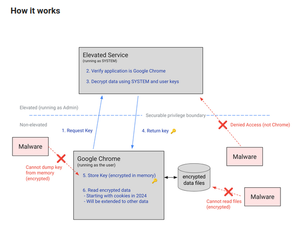

Chrome vẫn sẽ lưu trữ key được bảo vệ trong file Local State, và các thông tin đăng nhập trong các file Cookies, Login Data như các phiên bản cũ. Khác biệt là trong file Local State sẽ có thêm trường "*app_bound_encrypted_key*" để lưu trữ key được mã hóa bởi DPAPI system và các giá trị lưu trữ được mã hóa khi áp dụng ABE sẽ có header "76 32 30" ("v20") thay vì "v10".

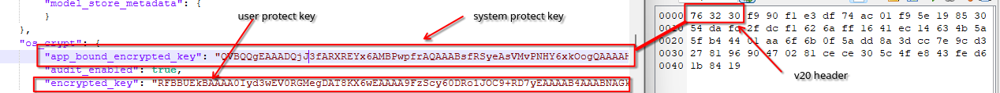

Đối với trình duyệt chạy dưới tài khoản người dùng thay vì sử dụng quyền system, các trình duyệt chromium sẽ sử dụng cơ chế COM để giao tiếp với tiến trình elevated service, thành phần này sẽ có nhiệm vụ kiểm tra xem tiến trình yêu cầu có hợp lệ hay ko để thực hiện giải mã data. Việc verify hiện mới chỉ dừng lại ở việc kiểm tra đường dẫn của tiến trình có nằm trong thư mục cài đặt hay không.

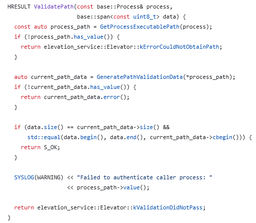

ABE dựa vào quyền SYSTEM của hệ thống để bảo vệ key của nhiều profile người dùng lưu trữ trên trên hệ thống. ABE sẽ không được áp dụng trong một số trường hợp sau:

- Trình duyệt không được cài với quyền Administrator/System
- Thư mục lưu trữ profile của người dùng không được hỗ trợ

  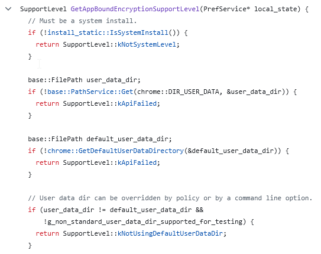
- GroupPolicy được bật để tắt ABE
- Profile thuộc Guest hoặc các Profile được lưu trữ, chia sẻ qua mạng để dùng trên nhiều máy (roaming profile)

  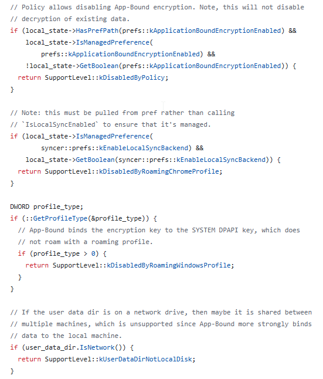
- Tiến trình của trình duyệt chạy trên không chạy từ local path (eg: \\\\10.1.1.2\\...\\chrome.exe)

  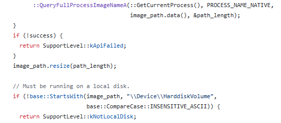

# Các phương pháp của stealer

Stealer luôn rất nhanh chóng, cập nhật các kỹ thuật để vượt qua các giải pháp bảo vệ đã có. Dưới đây là 1 số kỹ thuật phổ biến để stealer thực hiện chức năng của chúng.

## Bypass ABE
Khi thực thi trên máy, stealer hoàn toàn có thể khai thác các lỗ hổng chưa được vá của các ứng dụng hay thành phần của windows để thực hiện leo quyền. Khi đó stealer sẽ có 2 cách để tiếp tục đánh cắp dữ liệu:
- Copy payload/mã độc thực hiện việc đánh cắp dữ liệu vào thư mục cài đặt của trình duyệt (thường trong C:\\Program Files\\.. nên cần thực hiện leo quyền để copy file vào). Khi đó việc xác thực thông qua đường dẫn sẽ bị vượt qua và sleater có thể thực thi thông qua giao tiếp COM như các trình duyệt hoạt động để giải mã dữ liệu. Hiện đã có POC cho phương pháp này, tham khảo tại [elevator_decrypt_key.cpp](https://gist.github.com/snovvcrash/caded55a318bbefcb6cc9ee30e82f824): 
  
  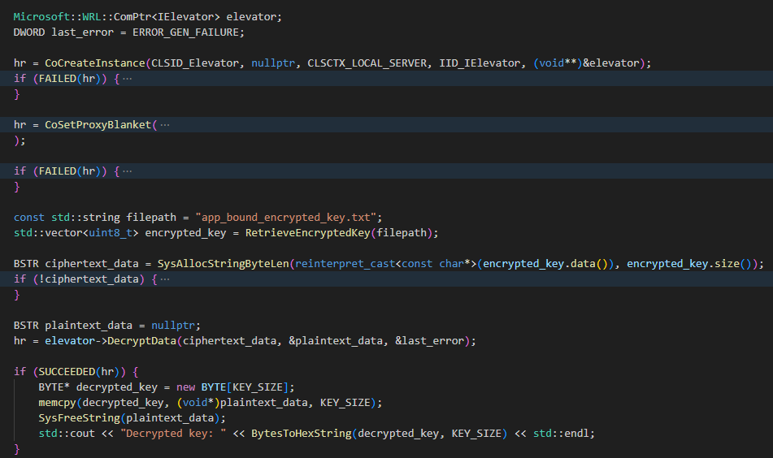

- Nếu thực thi được với quyền system, stealer có thể tự đọc và giải mã "*app_bound_encrypted_key*" bằng DPAPI với 2 bước:
  - Sử dụng CryptUnprotectData với quyền SYSTEM để giải mã lần 1.
  - Impersonate về context của user tương ứng và tiếp tục dùng CryptUnprotectData để giải mã key của từng user.

    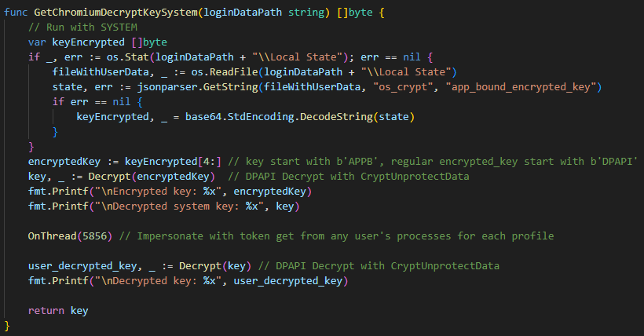

Cách thứ 2 hiện chưa ổn định do sau khi giải mã "*app_bound_encrypted_key*", một số trình duyệt (như chrome) có thể có cơ chế xử lý riêng dữ liệu giải mã trước khi trả về kết quả.

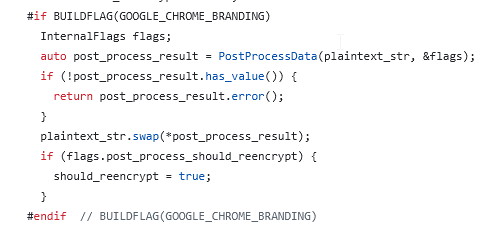

Nếu không thể leo quyền, stealer có thể inject vào trong các tiến trình của trình duyệt và thực hiện giải mã bằng giao tiếp COM bên trong tiến trình của trình duyệt. Lúc này việc xác minh vẫn được coi là hợp lệ.

## Một số phương pháp khác

Việc áp dụng ABE sẽ không có tác dụng khi stealer sử dụng cách 1. và 2. dưới đây. Cách số 3 sẽ giúp stealer bypass các giải pháp theo dõi việc đọc các file nhạy cảm của của trình duyệt (Local State, key.db,..)

### 1. [ChromeKatz](https://github.com/Meckazin/ChromeKatz) - Dump dữ liệu trên vùng nhớ của tiến trình chromium

Kỹ thuật này dựa trên cơ sở khi các trình duyệt khởi động, chúng sẽ tự load dữ liệu từ database và lưu trữ ở trên các vùng nhớ. ChromeKatz xác định các pattern có thể sử dụng để  xác định các vùng dữ liệu chứa mật khẩu, cookie của người dùng trên các vùng nhớ của tiến trình trình duyệt và thực hiện dump trực tiếp dữ liệu mà không cần truy xuất các file database hay giải mã bằng DPAPI.

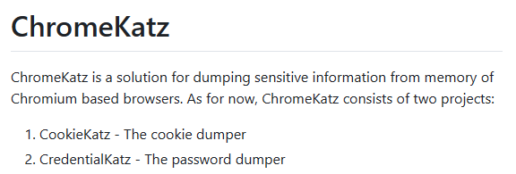

Kỹ thuật này đòi hỏi phải cập nhật liên tục các pattern để có thể tìm đúng dữ liệu trên memory và cập nhật các cấu trúc dữ liệu phù hợp để parse vùng dữ liệu đó.

### 2. Remote debugging
   
Tính năng cho phép debugger giao tiếp với tiến trình chromium, từ đó debugger có thể yêu cầu các trình duyệt trả về các dữ liệu mong muốn, trong đó bao gồm cả các thông tin nhạy cảm như Cookies. 

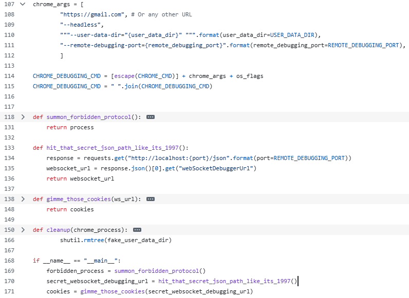

### 3. Đọc trực tiếp thông qua MFT  trên NTFS

Khi thực hiện theo dõi các file trên đĩa, đa số các giải phảp bảo mật sẽ theo dõi các đường dẫn của Windows thông qua driver. Mã độc stealer có thể bypass bằng cách đọc trực tiếp từ MFT thông qua RawAccess mà không sử dụng các api như ReadFile, CopyFile để tránh bị phát hiện.

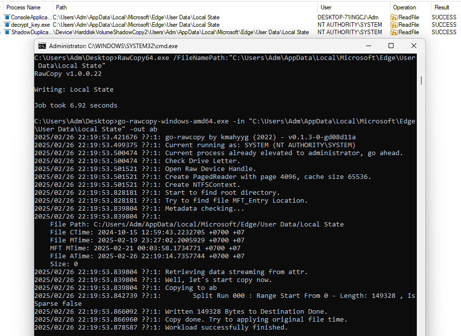

# Tổng kết

Áp dụng ABE khiến các dòng stealer phải thực hiện nhiều tác vụ hơn trước khi đánh cắp dữ liệu nhưng có thể thấy stealer đã thích ứng rất nhanh và cập nhật các tính năng để thực hiện công việc của chúng. Việc hunting, theo dõi, phát hiện để cảnh báo sớm khi bị tấn công bằng stealer có thể dựa vào các event dưới đây:

| Event ID| Event Name| Event Source| Detection opportunity |
| --------| ----------| ----------|----------|
| 1-4688| Process Create| Sysmon/Security Audit| Tiến trình trình duyệt tạo ra bởi tiến trình cha bất thường (ví dụ về tiến trình bất thường: không phải các chương trình đã biết, không ký hợp lệ, nằm trong các thư mục nhạy cảm như programdata, public, temp,.. hoặc chạy với quyền SERVICE, SYSTEM,...)| 
|||| Tiến trình trình duyệt với command line nghi ngờ như `--remote-debugging-port=, --remote-allow-origins=, --headless,...`|
|||| Các tiến trình lạ nằm trong thư mục cài đặt của trình duyệt. vd `C:\Program Files\Microsoft\Edge\Console1.exe`|
| 4663| Object Access| Security Audit| Tiến trình bất thường truy cập vào các file chứa thông tin như `Local State, key.db,..` |
| 11-4663|File Create/Object Access| Sysmon/Security Audit| Các file bất thường được tạo ra trong thư mục của trình duyệt|
| 10| Process Access| Sysmon| Các tiến trình bất thường truy cập vào tiến trình của trình duyệt|
| 9| Raw Access Read| Sysmon| Các tiến trình bất thường yêu cầu truy cập thông qua RAW `\\.\`|

# Tham khảo
- https://security.googleblog.com/2024/07/improving-security-of-chrome-cookies-on.html
- https://gist.github.com/snovvcrash/caded55a318bbefcb6cc9ee30e82f824
- https://www.elastic.co/security-labs/katz-and-mouse-game
- https://mango.pdf.zone/stealing-chrome-cookies-without-a-password/
- https://github.com/thewh1teagle/chrome-privless-encryption
- https://github.com/Meckazin/ChromeKatz
- https://github.com/PeterUpfold/ShadowDuplicator
- https://github.com/kmahyyg/go-rawcopy
- https://github.com/jschicht/RawCopy