---
layout: post
title: Một số phương pháp peristence khó "nhìn thấy"
date: 2025-07-30
subtitle: Some notes about uncommon persistence methods
tags:
- windows
- malware
- threathunting
- forensic
--- 
- [Chain quá trình thực thi với một số chương trình sạch - (POC: Powershell Profile)](#chain-quá-trình-thực-thi-với-một-số-chương-trình-sạch---poc-powershell-profile)
- [Persistence add/remove on the fly - (POC - WM\_QUERYENDSESSION handler)](#persistence-addremove-on-the-fly---poc---wm_queryendsession-handler)
- [COM Model + Library File](#com-model--library-file)
- [Lưu ý, khuyến nghị khi thực hiện rà soát.](#lưu-ý-khuyến-nghị-khi-thực-hiện-rà-soát)
- [Tham khảo](#tham-khảo)

*It’s already written, so count it for 2025-02*

Trong quá trình CA/Hunting, mình gặp phải một vài mẫu mã độc sử dụng các kỹ thuật persistence ít gặp, khó nhìn thấy khi sử dụng công cụ như Autoruns. Bài này ghi lại một số POC và lưu ý để phát hiện các kỹ thuật này.

# Chain quá trình thực thi với một số chương trình sạch - (POC: Powershell Profile)

Đây là một kỹ thuật tương tự như DLL Sideloading và DLL Hijacking: Lợi dụng các ứng dụng được ký, tin tưởng để thực thi các payload độc hại khác, các payload độc hại sẽ không trực tiếp xuất hiện trên các khóa autorun. 

Khi sử dụng Dll Sideloading, cần phải có 1 tập tin exe sạch, được ký làm host để load dll, đi kèm với nó là 1 hoặc nhiều dll payload đã bị sửa đổi. Khi đó, mã độc thường thêm khóa ASEP như Run, cheduler, service để thực thi file exe. Lúc này autoruns sẽ chỉ hiển thị khóa tự động chạy với đường dẫn tới file exe sạch.

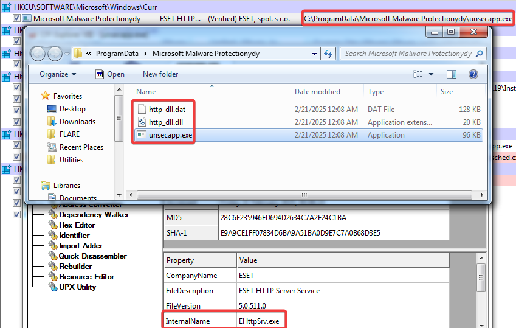

Đối với DLL Hijacking, DLL payload cần được đặt vào 1 trong các thư mục phù hợp để khai thác lỗi của các chương trình có thể bị hijack. Nhưng đa số trường hợp DLL Hijacking thường phải có quyền cao hơn user thường để đặt payload vào trong các thư mục của hệ thống và ít trường hợp có thể đặt vào các thư mục thông thường để thực hiện hijack.

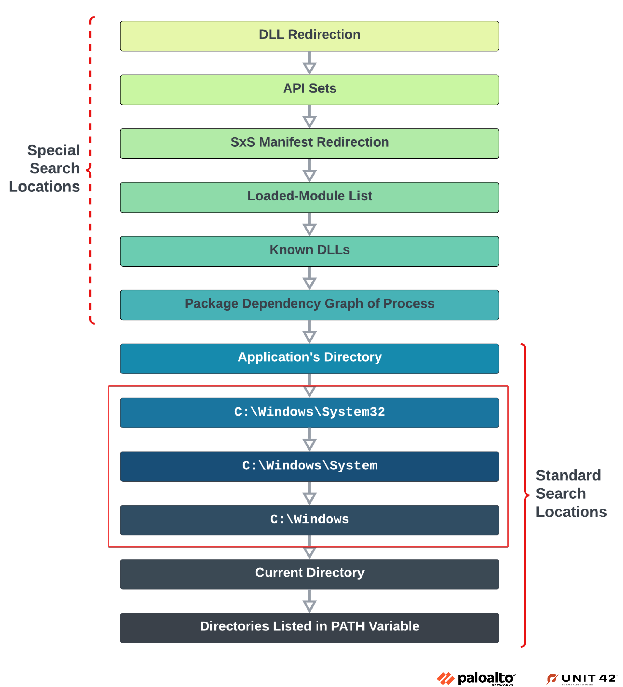

Có một số cách khác để thực hiện việc này như:
- Lợi dụng các tập tin [LOLBAS](https://lolbas-project.github.io/) với chức năng "Execute" sử dụng các cơ chế có thể khai thác như đọc thông tin/path payload từ file config mà user kiểm soát được, sử dụng payload là file cùng thư mục hoặc được thiết lập trong khóa registry. Một số ví dụ với từng trường hợp:
    - [Addinutil](https://lolbas-project.github.io/lolbas/Binaries/Addinutil/#execute)
    - [CustomShellHost](https://lolbas-project.github.io/lolbas/Binaries/CustomShellHost/#execute)
    - [Verclsid](https://lolbas-project.github.io/lolbas/Binaries/Verclsid/#execute) hoặc [Xwizard](https://lolbas-project.github.io/lolbas/Binaries/Xwizard/#execute)

- Khai thác các công cụ đã cài đặt trên máy như powershell, các file script/ứng dụng quản trị, theo dõi hệ thống và các chức năng liên quan... 
    - Ví dụ với [Powershell profile](../assets/2025-07-30-hidden_persistence_202502/poc/attack_ps_profile.c), khi không kiểm tra nội dung các tệp [profile.ps1](https://learn.microsoft.com/en-us/powershell/module/microsoft.powershell.core/about/about_profiles?), khó có thể xác định bất thường dựa vào thông tin từ entry autorun.
    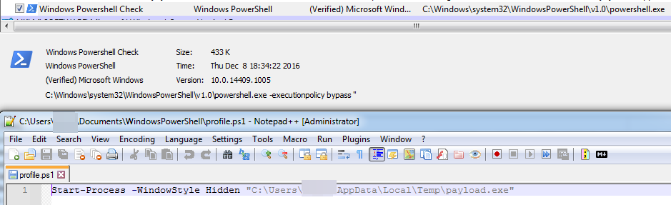

Mặc dù vẫn có thể dựa vào đường dẫn của tập tin trong khóa autoruns (đường dẫn bất thường), nội dung command hay kiểm tra sâu hơn các thuộc tính khác (tên file thực tế và internal name trong cấu trúc PE, và nội dung các file nằm trong cùng thư mục bao gồm unsigned dll, các file có entropy cao, cấu hình, nội dung script,...) của khóa autoruns nghi ngờ (dựa vào baseline hệ thống, case tương tự,..) để kiểm tra kỹ hơn nhưng đây cũng là một lớp để giảm khả năng bị phát hiện khi thực hiện persistence.

# Persistence add/remove on the fly - (POC - WM_QUERYENDSESSION handler)

Kỹ thuật này được thực hiện theo cơ chế chỉ thêm persistence khi phiên đang hoạt động có thể bị ngắt bởi các hoạt động thông thường như Logout, Shutdown,.. Khi đó mã độc sẽ không tạo persistent mà chờ đến khi phát hiện các sự kiện đặc biệt mới tiến hành. Việc rà soát autorun sẽ không đem lại kết quả, nhưng mỗi khi các hành vi như Logout, Shutdown xảy ra, autorun sẽ tự động được thêm vào và mã độc có thể tiếp tục thực thi ở các lần khởi động tiếp theo của hệ thống.

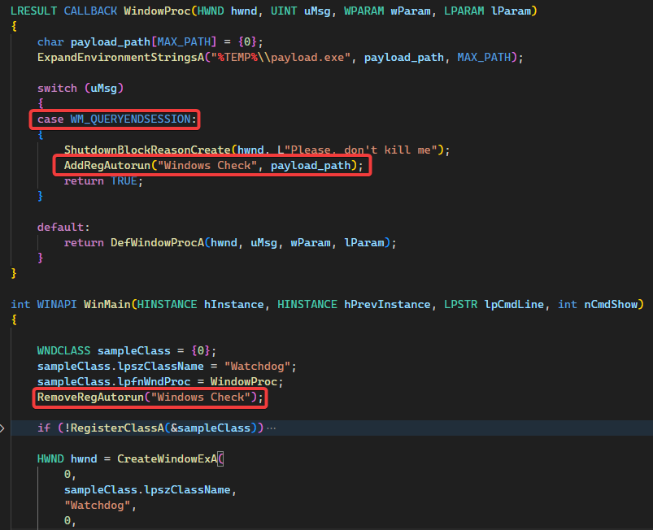

Hạn chế có thể gặp là sẽ bị mất persistence khi tiến trình theo dõi không nhận biết được các sự kiện đặc biệt trên (vì ngắt điện đột ngột, hoặc các ứng dụng khác yêu cầu Logout/Shutdown mà không gửi notify,..)

- [POC tham khảo](../assets/2025-07-30-hidden_persistence_202502/poc/handler.c)

# COM Model + Library File

Kỹ thuật tiếp theo lợi dụng tập tin .libray-ms và COM Model để thực hiện load 1 dll bất thường bằng explorer mà không cần tạo entry ASEP. Có 2 bước để thực hiện kỹ thuật này.

1. Tạo COM class object trong registry để thực thi dll payload

Đầu tiên cần chuẩn bị file payload dll phù hợp với COM model

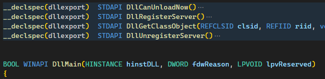

Sau đó, tạo khóa CLSID với GUID ngẫu nhiên, trong đó tạo 2 khóa con InProcServer32 và ShellFolder. Trong khóa InProcServer32, giá trị (Default) sẽ trỏ tới dll payload đã chuẩn bị, ThreadingModel có thể gán 1 trong các giá trị như trong bài [sau](https://learn.microsoft.com/en-us/windows/win32/com/inprocserver32).

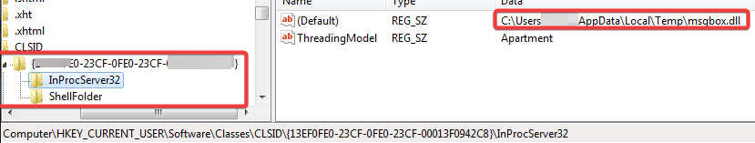

Trong khóa ShellFolder, tạo DWORD Attributes có giá trị là 0xf090013d. Việc này giúp chuẩn bị phần payload vào trong file .library-ms sau này và cho phép payload được tiến trình explorer load lên thay vì các tiền trình khác như dllhost.exe và verclsid.exe. 

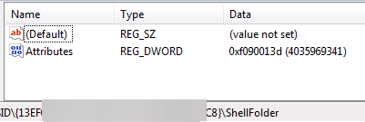

Ngoài ra, sau khi đã chuẩn bị nội dung registry trên, khi tạo một thư mục với tên `NewFolder.<CLSID>` (ví dụ `C:\newfolder.{1aef7ed5-3edd-40a3-8387-37242f20bccd}`) và truy cập thư mục này, Dll payload cũng có thể được thực thi. Thư mục có format tên như vậy gọi là Junction Folder.

2. Tạo file Library để thực thi COM object

[Libray](https://wikileaks.org/ciav7p1/cms/page_13763381.html) (.library-ms) là các file thư viện có định giạng XML, có tác dụng để explorer hiển thị nội dung của nhiều thư mục trong cùng một lúc. Library file có thể bị lợi dụng theo nhiều cách khác nhau thông qua thuộc tính SearchConenectionDescription/SimpleLocation/Url. Các thuộc tính này mô tả các thư mục để explorer kiểm tra nội dung và gộp vào. Trên windows có nhiều file .library-ms mặc định trong thư mục `%appdata%\Microsoft\Windows\Libraries` có thể dùng làm template để chỉnh sửa payload trong thuộc tính `<url>`

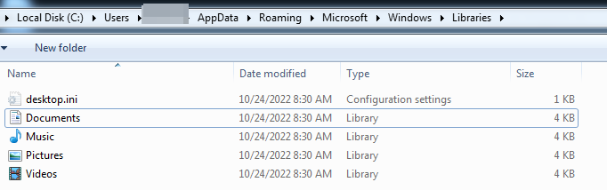

- Trỏ tới URL(WebDAV)/UNC path để hiển thị nội dung từ WebDAV server qua internet. Gần đây còn công bố [CVE-2025-24071/CVE-2025-24054](https://research.checkpoint.com/2025/cve-2025-24054-ntlm-exploit-in-the-wild/) để leak NTLM hash khi sử dụng SMB path trong file library-ms.
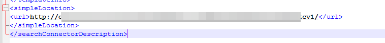

- Trỏ tới Juntion Folder hoặc thư mục bên trong junction folder (có thể không tồn tại) để thực thi COM dll ứng với CLSID của junction folder.
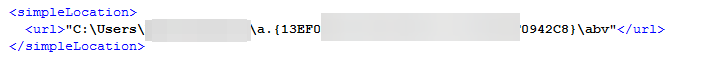

- Trỏ tới CLSID với format `shell:::<CLSID>` để thực thi COM dll, ngoài ra có thể sử dụng format `knownfolder:<CLSID>` để thực thi sau các [CLSID mặc định](https://learn.microsoft.com/en-us/windows/win32/search/search-schema-sconn-url) sau khi đã chỉnh sửa giá trị (Default) của khóa registry InProcServer32 tương ứng.
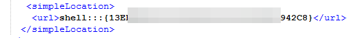

Sau khi chỉnh sửa hoặc tạo bản sao các file .library-ms với payload thích hợp để (Junction folder hoặc shell), mỗi khi người dùng truy cập các file này, `<url>` sẽ được phân giải và payload được thực thi. 

Để có thể tạo persistent thông qua các tập tin này, chỉ cần đặt file .libary-ms vào thư mục `%appdata%\Microsoft\Windows\Start Menu\Programs`. Thư mục này sẽ được explorer tự động kiểm tra thường xuyên, nếu gặp các file .library, explorer sẽ truy vấn các giá trị `<url>` để hiện thị và gián tiếp thực thi payload COM dll.

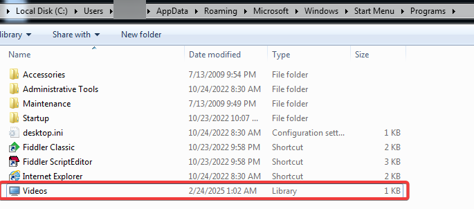

- [POC tham khảo](../assets/2025-07-30-hidden_persistence_202502/poc/com_junction_library_combo.c)

Trigger tại start menu tương đối hiệu quả với các máy tính của người dùng cuối, còn với các máy chủ Windows Server thì khả năng kích hoạt payload từ start menu sẽ thấp hơn.

# Lưu ý, khuyến nghị khi thực hiện rà soát.

Khi thực hiện kiểm tra persistence, để tránh bỏ sót các dấu vết, có một số lưu ý sau đây:
- Luôn verify các khóa autorun trỏ tới các tiến trình lolbas: Kiểm tra command, các thông tin có thể bị lợi dụng
- Xác minh các file profile của powershell: bao gồm cả profile của alluser và từng user.
- Kiểm tra các script quản trị: thời gian sửa đổi, nội dung 
- Rà soát kiểm tra các thuộc tính `<URL>` trong các file `.library-ms` trên máy
- Rà soát các thư mục có tên dạng Junction `folder_name.<CLSID>`
- Rà soát thêm các khóa registry nghi ngờ: 
    - `(HKLM|HKCU)\Software\Classes\...\(InProcServer|InProcServer32|LocalServer|LocalServer32)`

# Tham khảo
- https://learn.microsoft.com/en-us/powershell/module/microsoft.powershell.core/about/about_profiles?view=powershell-7.5
- https://www.apriorit.com/dev-blog/413-win-api-shutdown-events
- https://blog.f-secure.com/hunting-for-junction-folder-persistence/
- https://wikileaks.org/ciav7p1/cms/page_13763373.html 
- https://www.hackingarticles.in/windows-persistence-com-hijacking-mitre-t1546-015/
- https://www.hexacorn.com/blog/category/autostart-persistence/

